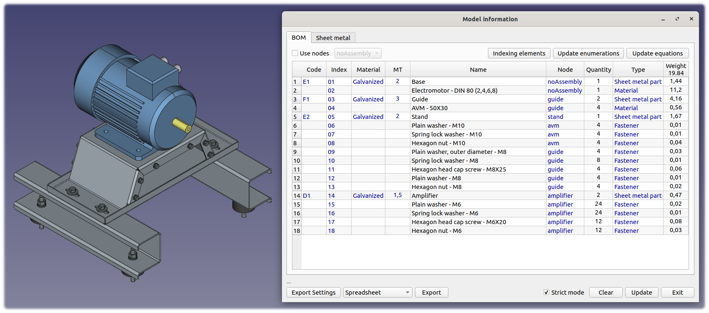
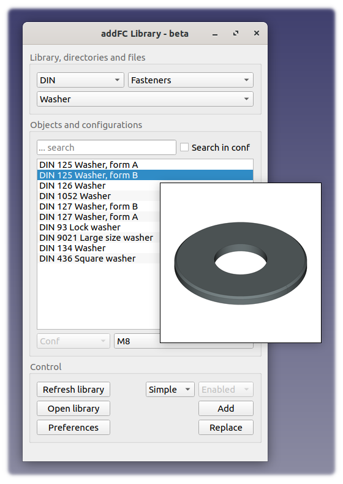
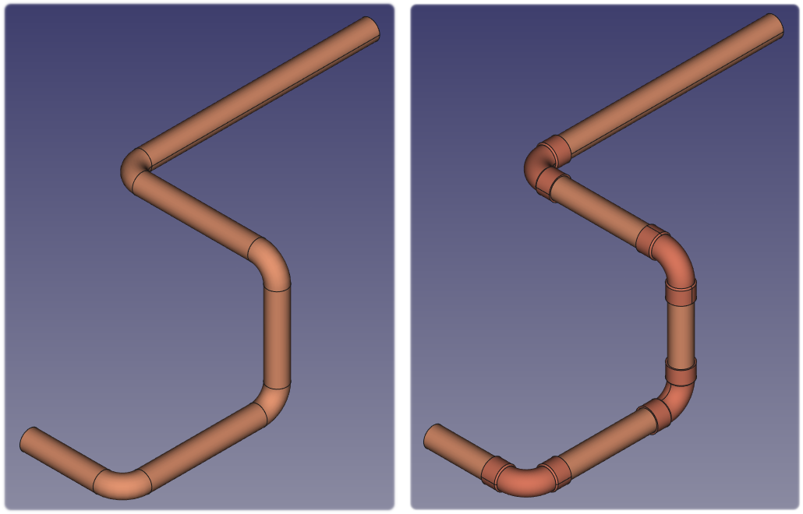

# addFC - additional tools for FreeCAD

Current version 1.2.4 - [release notes](CHANGELOG.md).

### Overview

This workbench contains tools that simplify the solution of some tasks in FreeCAD.

At the moment it is:

1. Generate a BOM based on the model.
2. Batch processing of sheet metal parts.
3. Component library - [internal](repo/add/Library.md).
4. Assistance in creating design documentation.
5. Exploded view (creation and visualization) - [preview](https://youtu.be/G9eikdejY6g).
6. Creating a pipeline.
7. Process automation.

### Preview

Bill of materials - BOM

Component library - beta

Pipeline and pipe fittings

Explosion (30 FPS)

## Description

### Toolbox

1. Open last working file
2. Isometry and fit all
3. Run the model control file
4. Bill of materials - BOM
5. Add properties to an object
6. Create a drawing based on a template
7. Library of elements and nodes
8. Exploded view
9. Creating a pipe by points
10. Documentation, help and examples

### Documentation

[Quick reference guide](/repo/doc/quickstart_EN.md)

[Documentation](repo/doc) available in PDF format:

* [English](https://digiroad.tech/share/addFC/documentation_EN.pdf)
* [Russian](https://digiroad.tech/share/addFC/documentation_RU.pdf)

Forum:

* [FreeCAD forum thread](https://forum.freecad.org/viewtopic.php?t=91329)
* [FreeCAD тема на русском языке](https://forum.freecad.org/viewtopic.php?t=91598)

### Notes

The workbench is under development.

Testing is performed on stable versions (0.20 and 0.21) of FreeCAD.

__Potential sheet metal issues when running version 1 and above.__

If you encounter problems after the update, try deleting the preferences directory:

`FreeCAD/Mod/addFC/pref`

## Installation

### Addon Manager

This workbench is available through the FreeCAD [Addon Manager](https://github.com/FreeCAD/FreeCAD-addons/#1-builtin-addon-manager) (menu __Tools__ > __Addon Manager__). It is called __addFC Workbench__ in the Addon Repository.

<b>Manual Installation (Click to expand)</b>

### Manual installation

Download the [archive](https://github.com/GS90/addFC/archive/main.zip), unzip it and move the __addFC__ folder to the directory containing all additional FreeCAD modules:

* Linux: `~/.local/share/FreeCAD/Mod`
* MacOS: `~/Library/Preferences/FreeCAD/Mod`
* Windows: `C:\Users\***\AppData\Roaming\FreeCAD\Mod`

Or, while in the directory with modules, use [git](https://git-scm.com):

`git clone https://github.com/GS90/addFC`

To update the module, while in the __addFC__ directory, use:

`git pull -r`

### Dependencies

Requirements:

* FreeCAD >= 0.20
* Python >= 3.10

For full functionality, you need:

* [FreeCAD SheetMetal Workbench](https://github.com/shaise/FreeCAD_SheetMetal) >= 0.6.13
* Additional Python Modules: [numpy](https://pypi.org/project/numpy) and [ezdxf](https://pypi.org/project/ezdxf)
* [FFmpeg](https://ffmpeg.org)

When installing the workbench using __Addon Manager__, all dependencies (except FFmpeg) will be installed automatically.

To install additional Python modules manually, the easiest way is to use [pip](https://en.wikipedia.org/wiki/Pip_(package_manager)):

* `pip install numpy ezdxf`

## License

[LGPL-2.1-or-later](LICENSE)

[Workbench icons](https://en.wikipedia.org/wiki/Tango_Desktop_Project)
